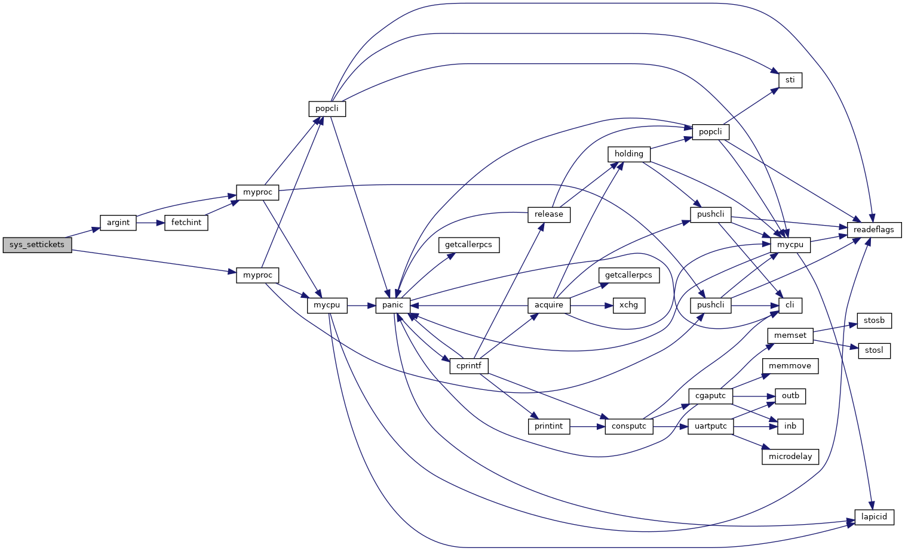
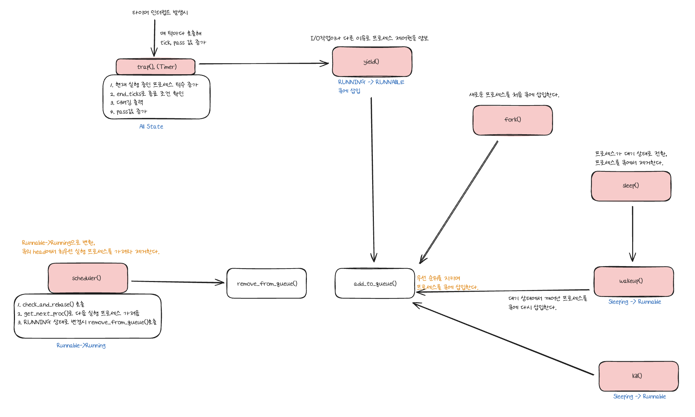

<div align="center">

# ⚙️ XV6 Stride Scheduler

**XV6 운영체제 커널의 Round Robin 스케줄러를 Stride Scheduling 알고리즘으로 교체**

[](https://github.com/joejaeyoung/OS_Study-StrideScheduling)

</div>

---

## 📋 프로젝트 정보

|    항목     | 내용                  |
| :-------: | :------------------ |
|  **분야**   | OS                  |
| **개발 기간** | 2024.09             |
| **개발 환경** | Ubuntu Linux + QEMU |

---

## 📖 프로젝트 소개

이 프로젝트는 MIT에서 개발한 교육용 운영체제 **XV6**의 기본 **Round Robin 스케줄러**를 **Stride Scheduling 알고리즘**으로 완전히 교체한 프로젝트입니다.

Stride Scheduling은 각 프로세스가 보유한 **티켓(ticket) 수에 비례**하여 CPU 시간을 **결정론적으로 분배**하는 알고리즘입니다. 난수를 사용하는 Lottery Scheduling과 달리, pass 값을 기반으로 항상 예측 가능하고 일관된 스케줄링 성능을 제공합니다.

**우선순위 큐(이중 연결 리스트)** 를 활용하여 O(1)으로 다음 실행 프로세스를 선택하며, **오버플로우 방지 메커니즘(rebase)** 을 통해 장기간 안정적인 동작을 보장합니다.

---

## 🚀 시작 가이드

### Requirements

- GCC (i686-linux-gnu cross compiler)
- GNU Make
- QEMU (qemu-system-i386)

### Installation & Run

```bash
# 1. XV6 원본 소스 클론
$ git clone https://github.com/mit-pdos/xv6-public.git
$ cd xv6-public

# 2. Stride Scheduler 소스 클론 및 덮어쓰기
$ git clone https://github.com/jojaeyoung/OS_Study-StrideScheduling.git
$ cp OS_Study-StrideScheduling/srcs/* .

# 3. 빌드 및 실행
$ make qemu
```

### 디버그 모드 실행

```bash
# 기본 디버그 출력
$ make qemu debug=1

# 큐 상태 출력 포함
$ make qemu debug=2

# rebase 과정 출력
$ make qemu debug=3
```

### 테스트 실행 (XV6 쉘 내부)

```bash
$ debug_test
$ syscall_test
$ scheduler_test
```

---

## 🛠️ Stacks

### Environment


### Development


### Config


---

## 📺 시스템 콜 인터페이스

### `settickets(int tickets, int end_ticks)`

| 항목 | 설명 |
|:---|:---|
| **시스템 콜 번호** | 22 |
| **첫 번째 인자** | `tickets` — 프로세스가 보유할 티켓 수 (1 이상, STRIDE_MAX 이하) |
| **두 번째 인자** | `end_ticks` — 프로세스 종료까지의 틱 수 (1 이상일 때만 적용) |
| **반환값** | 성공 시 `0`, 실패 시 `-1` |
| **stride 계산** | `stride = STRIDE_MAX / tickets` |

#### 사용 예시

```c
// 티켓 10개, 500틱 후 종료
settickets(10, 500);

// 티켓 50개, 수명 제한 없음
settickets(50, -1);
```

#### 콜그래프

<div align="center">

</div>

---

## ⭐ 주요 기능

### 1. Stride 기반 프로세스 스케줄링

- **RUNNABLE** 상태인 프로세스 중 **pass 값이 가장 작은** 프로세스 우선 선택
- pass 값 동일 시 **PID가 작은** 프로세스 우선
- 갱신 공식: `pass = pass + stride`
- 티켓 수가 많을수록 stride가 작아져 **더 자주 선택**됨

### 2. 우선순위 큐 (이중 연결 리스트)

- pass 값 오름차순, 동일 시 PID 오름차순 자동 정렬
- **O(1)** 으로 큐의 head에서 다음 실행 프로세스 선택
- `add_to_queue()` / `remove_from_queue()` 로 동적 관리

### 3. 오버플로우 방지 시스템 (Rebase)

- 큐의 tail pass 값이 `PASS_MAX(15000)` 초과 시 정규화 실행
- 최소 pass 값을 0으로 설정 후 모든 프로세스 동일하게 감소
- 프로세스 간 pass 차이가 `DISTANCE_MAX(7500)` 초과 시 추가 조정

### 4. 프로세스 수명 관리

- `end_ticks` 값이 양수이고 `ticks >= end_ticks`인 경우 강제 종료
- `end_ticks`가 `-1`이면 수명 제한 없음

### 5. 디버깅 추적 시스템

- 프로세스 CPU 할당/반납, 생성/종료 시점의 상태 정보 출력
- PID와 부모 PID가 모두 2보다 클 때만 출력 (시스템 프로세스 필터링)

---

## 🏗️ 아키텍쳐

### 스케줄러 동작 흐름

<div align="center">

</div>

### 핵심 상수 정의

| 상수 | 값 | 설명 |
|:---|:---:|:---|
| `STRIDE_MAX` | 100,000 | stride 계산을 위한 최대값 |
| `PASS_MAX` | 15,000 | pass 오버플로우 임계값 |
| `DISTANCE_MAX` | 7,500 | 프로세스 간 pass 차이 최대 허용값 |

### 프로세스 구조체 확장 (proc.h)

| 필드 | 타입 | 기본값 | 설명 |
|:---|:---:|:---:|:---|
| `tickets` | int | 1 | 프로세스가 보유한 티켓 수 |
| `stride` | uint | 0 | STRIDE_MAX / tickets |
| `pass` | uint | 0 | 현재 pass 값 |
| `ticks` | int | 0 | CPU 점유 총 틱 수 |
| `end_ticks` | int | -1 | 프로세스 종료 틱 수 |
| `next` | proc* | 0 | 큐의 다음 노드 포인터 |
| `prev` | proc* | 0 | 큐의 이전 노드 포인터 |

### 디렉토리 구조

```
OS_Study-StrideScheduling/
├── README.md
├── docs/
│   └── images/             # 보고서 이미지
└── srcs/
    ├── Makefile            # 빌드 설정 (테스트 바이너리 등록, clean 타겟 수정)
    ├── proc.h              # 프로세스 구조체 확장 + 상수 정의
    ├── proc.c              # 스케줄러 핵심 로직 (scheduler, 큐 관리, rebase, settickets)
    ├── trap.c              # 타이머 인터럽트 처리 (ticks 갱신, 종료 조건, 디버깅 출력)
    ├── syscall.h           # 시스템 콜 번호 정의 (SYS_settickets = 22)
    ├── syscall.c           # 시스템 콜 디스패치 테이블 등록
    ├── user.h              # 유저 공간 함수 프로토타입
    └── usys.S              # 시스템 콜 어셈블리 스텁
```

### 수정 파일 역할 관계

| 파일 | 역할 | 핵심 변경 사항 |
|:---|:---|:---|
| `proc.h` | 데이터 구조 | 구조체 확장 + 상수 매크로 |
| `proc.c` | 스케줄러 핵심 | scheduler(), add/remove_queue, check_and_rebase, sys_settickets |
| `trap.c` | 인터럽트 처리 | ticks 갱신, pass 증가, 종료 조건, 디버깅 출력 |
| `syscall.h/c` | 시스템 콜 등록 | settickets 번호/디스패치 등록 |
| `user.h` + `usys.S` | 유저 인터페이스 | 유저 공간에서 호출 가능하도록 등록 |
| `Makefile` | 빌드 설정 | 테스트 바이너리 UPROGS 등록, clean 타겟 보호 |
